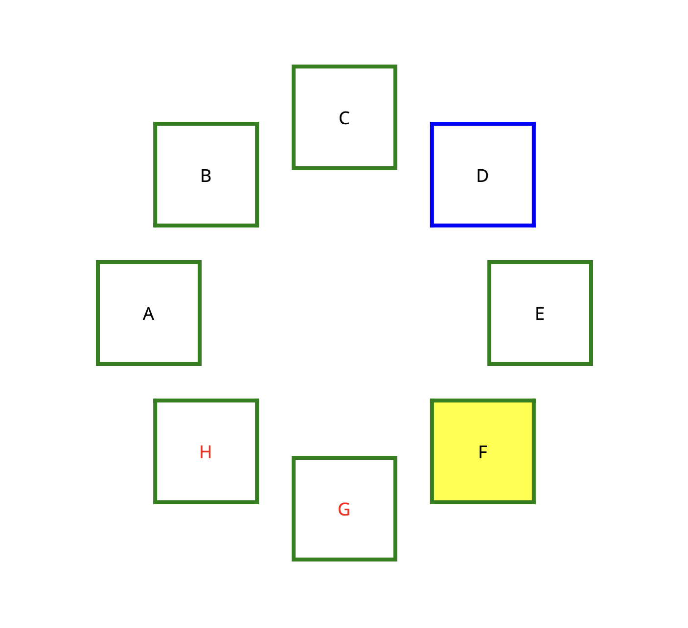
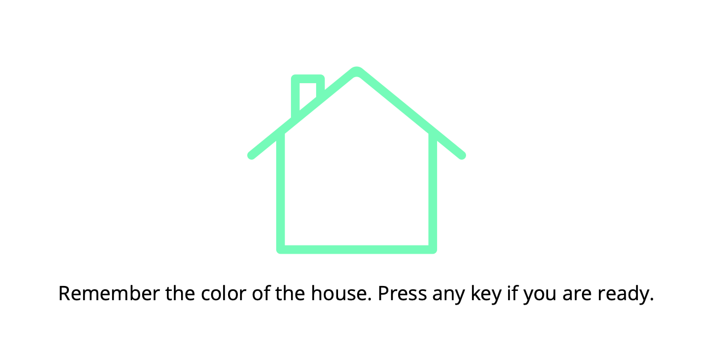
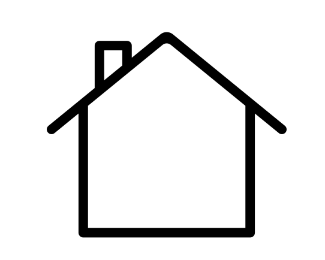
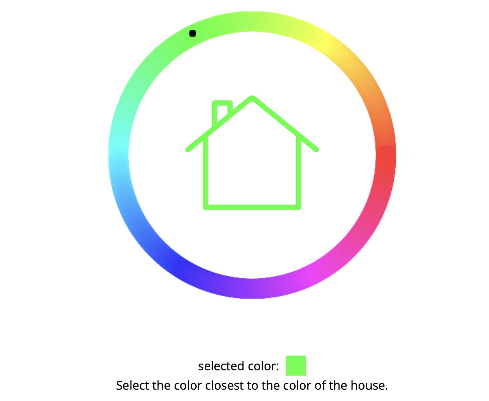

# 🌐 WebPsy.js 🧠

Free to use online library for programming of psychological online experiments - the JavaScript library tailored to elevate your psychological studies in the digital realm! 🚀 From academics, for academics.

Whether you're a curious psychologist, a dedicated researcher, or a tech-savvy cognitive scientist, _WebPsy.js_ is your indispensable toolkit for designing and conducting seamless web-based psychological experiments, with a particular focus on harnessing the power of jsPsych.


## Contributions and Feedback

Contributions and feedback are welcome; have a look at `CONTRIBUTING.md` for more information.

## Stimuli

These are functions that return HTML as a string. They can be used in any jsPsych trial that has a `stimulus` field. 

### `listenLocation` / window object

In some cases, stimuli need to return certain values (e.g. the color chosen by the user in the color picker). In order to read these values, these results are written to an attribute of the window object. Which attribute this is depends on the trial and is noted in the documentation of each trial. Values can then be accessed like this, for example:

```typescript

on_finish: (data: HtmlKeyboardResponseTrialData) => {
      console.log(window["color_picker__result"]);
    },

```

Certain experiments can also "listen" to the value of another experiment. For example, the Colored Graphic can change its color as soon as the user picks a color in the color picker. For this, the Colored Graphic trial takes a `listenLocation` argument, where the name of the window attribute can be provided. 

A complete example for this is the `color-picker-with-graphic` example experiment.


### Stimuli functions

#### Circle of Squares


Generates a number of squares laid out in a circle. Text or HTML can be placed inside the circle. If the user clicks on a square, its index (starting from 0) is written to `window.circle_of_squares__result`.

#### Colored Graphic



Takes a link to an svg file (in the `assets` folder of the experiment) and a color, then displays the SVG file in the specified color. The black areas of the original SVG file get colored in the specified color, e.g. this file is the source file of the screenshot above:



The stimulus can change color according to the `listenLocation`.

#### Color Picker



Generates a color picker. The user can select any color through clicking on a certain position of the color wheel. An HTML string can be provided that should be rendered in the center of the color wheel can be provided. In the screenshot above, it is the Colored Graphic stimulus. The chosen color is written to `window.color_picker__result`.

## Basic functions

These are functions that are needed frequently when creating experiments.

### Function overview

#### `chooseNElementsFromArray`

Chooses `n` elements from the given array randomly.

#### `shuffleArray`

Returns shuffled version of input array. Shuffles using Knuth's algorithm (an optimized version of the Fisher-Yates shuffle, see https://en.wikipedia.org/wiki/Fisher–Yates_shuffle)

### Types

Adds some much-needed types to jsPsych. Currently, we mostly provide types for the data generated by trials. If e.g. the `on_finish` function of an `HtmlKeyboardResponsePlugin` trial is annotated like this:

```typescript
on_finish: (data: HtmlKeyboardResponseTrialData) => {
      console.log(data.rt);
      console.log(data.abc);
    },

```

The second `console.log` line would be red underlined in the editor since the compiler can now check whether this attribute actually exists in the generated data.
